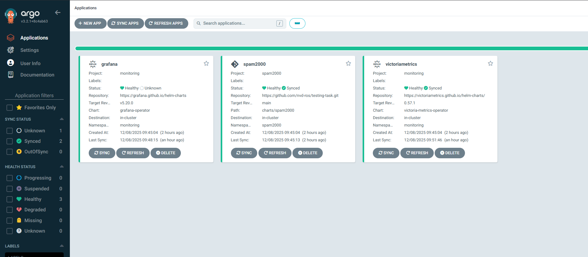
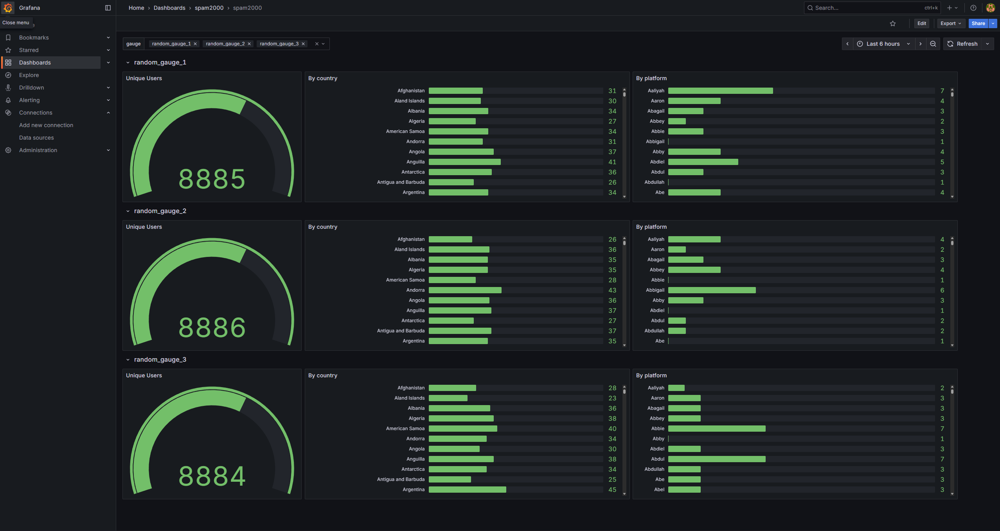
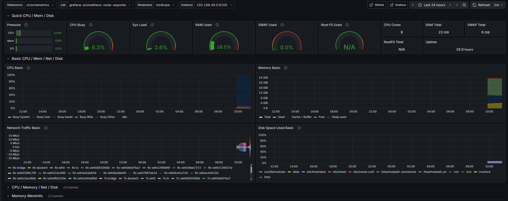
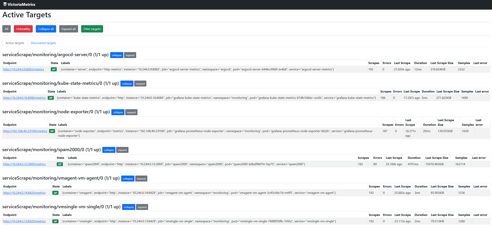

# Test Project
Test Project with minikube, Argocd, Grafana and VictoriaMetrics

---
## Table of Contents
- [About](#about)
- [Tech Stack](#tech-stack)
- [Requirements](#requirements)
- [Installation](#installation)
- [Screenshots](#screenshots)

---
## About

This repository provides an automated setup for a Kubernetes monitoring stack using **ArgoCD** and **Minikube**. It includes:

- Custom Helm charts for deploying the `spam2000` application.
- Pre-configured ArgoCD applications for:
  - **Grafana Operator**
  - **Grafana custom resources: `grafana`, `dashboards` and `datasources`**
  - **VictoriaMetrics Operator**
  - **Custom resources: `vmagent`, `vmservicescrape`, and `vmsingle`**
  - **Node Exporter**
  - **Kube State Metrics**
  - **Custom spam2000 application**

The repository also includes a **cluster creation script** (`bootstrap.sh`) that automates the setup of a local Kubernetes cluster using **Minikube**. By default, the script uses **Docker**, but you can configure it to use **Podman** instead. Use to see more:

```bash
./bootstrap.sh --help
```
---
## Tech Stack

This project uses the following technologies and tools:

- **Kubernetes** – Container orchestration platform
- **Minikube** – Local Kubernetes cluster for testing and development
- **ArgoCD** – Continuous delivery tool for managing Kubernetes applications
- **Helm** – Kubernetes package manager for deploying applications
- **Docker / Podman (container runtimes)** – Used by Minikube
- **Grafana Operator** – Manages Grafana custom resources (CRDs)
- **VictoriaMetrics Operator** – Manages VictoriaMetrics custom resources (CRDs)
- **Node Exporter** – Exposes node-level metrics
- **Kube State Metrics** – Exposes cluster state metrics
- **Bash** – Scripts for cluster automation (`bootstrap.sh`)
- **Node.js / NestJS** – Runtime and framework for the custom `spam2000` application (runs inside the pod)

## Requirements

Before running the script, make sure your system meets the following requirements:

- **Operating System:** Linux (tested on Ubuntu 22.04 and WSL2)
- **Docker:** Must be installed and running (used by default for Minikube)
- **Podman** (optional) – if you want to use these instead of Docker
- **kubectl** – command-line tool for interacting with Kubernetes
- **Minikube** – installed

Minikube / Helm / kubectl – If not present, `bootstrap.sh` will install them into the `bin/` directory in the repository root by default, so **no sudo privileges are required**.
Use to see more:

```bash
./bootstrap.sh --help
```

----
## Installation

Follow the steps below to run the project.

### 1. Clone the repository

```bash
git clone https://github.com/nvd-ros/testing-task.git
cd testing-task
```

### 2. Script arguments and settings (optional)

Run the script with the `--help` option to see all available parameters:
```bash
./bootstrap.sh --help
```

If you want to change the local ports used to access the web UIs, edit the following variables inside the script:
```bash
GRAFANA_LOCAL_PORT="3000"
VM_LOCAL_PORT="8229"
VMAGENT_LOCAL_PORT="8429"
SPAM2000_LOCAL_PORT="3030"
```

### 3. Run the bootstrap script

```bash
./bootstrap.sh
```

### 4. Update PATH variable (optional)

If the script installed any binaries into the `bin/` directory, you may want to add this directory to your `PATH` so you can run the tools without using absolute paths:
```bash
export PATH="$PATH:$PWD/bin"
minikube status
kubectl version --client
helm version
```

### 5. Open grafana

The script creates port-forwarding using kubectl and prints the URLs and credentials to stdout.
Use them to open the UIs for ArgoCD, Grafana, VictoriaMetrics, VMAgent, and the spam2000 application.

### 6. Cleanup (optional)

To delete the Minikube cluster and remove all deployed resources:

```bash
minikube delete
rm -rf ~/.minikube
```

## Screenshots

### ArgoCD Dashboard


### Grafana Dashboard



### VictoriaMetrics / VMAgent

